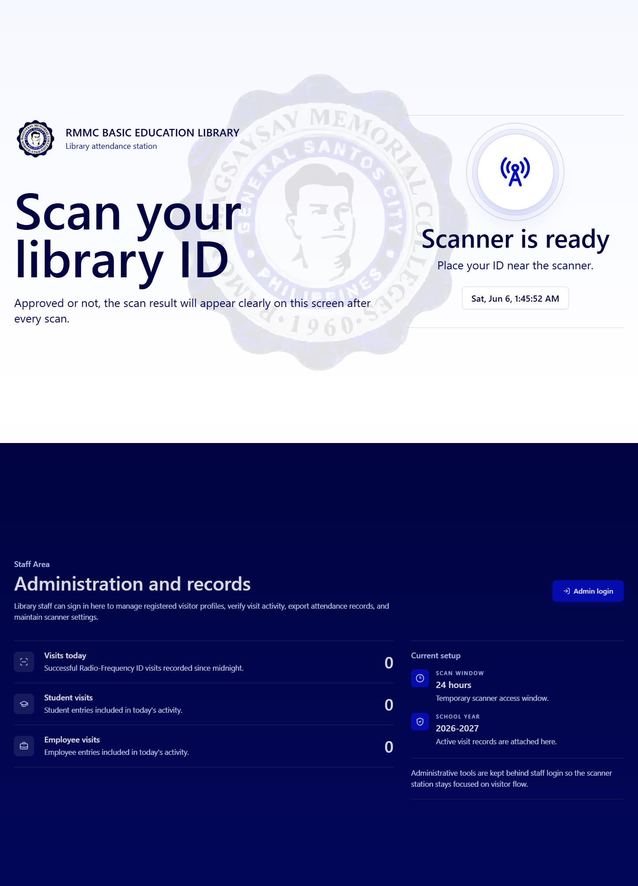
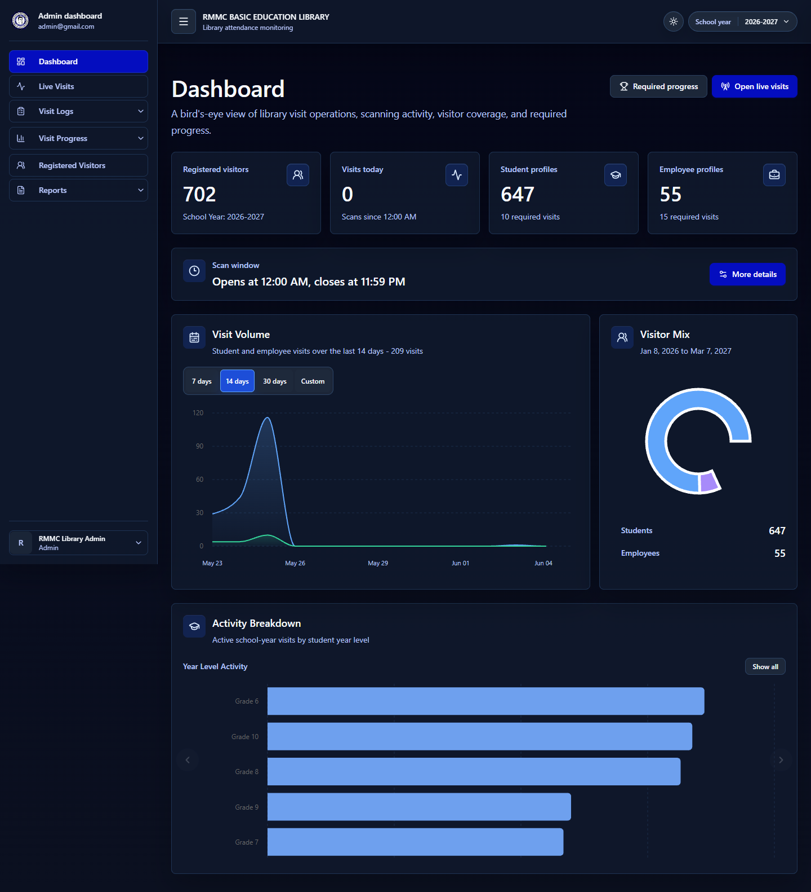
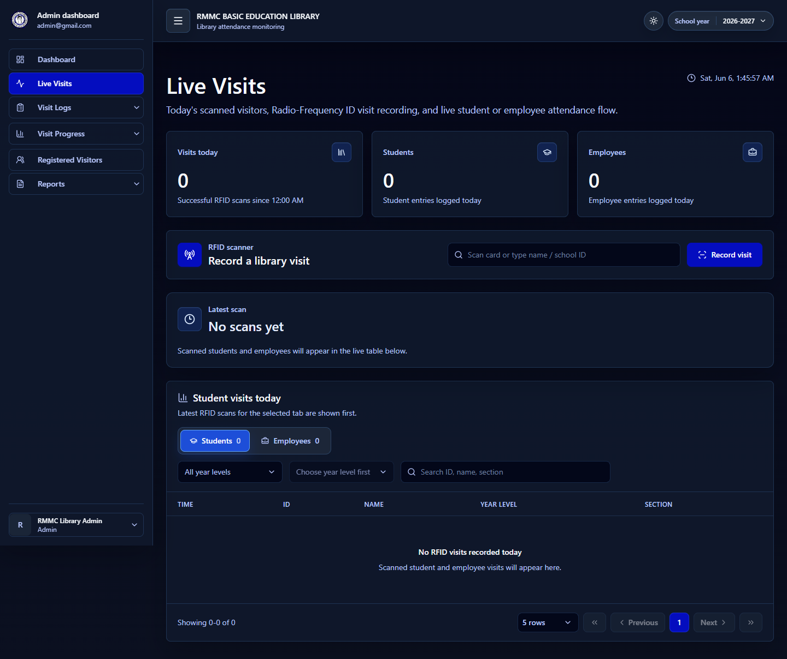
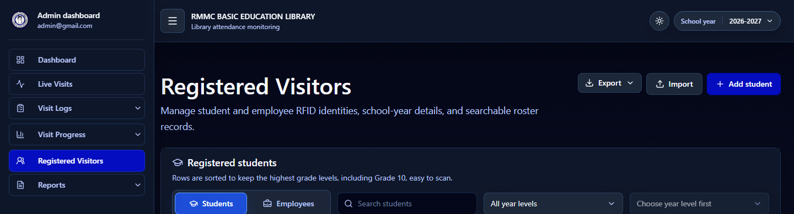
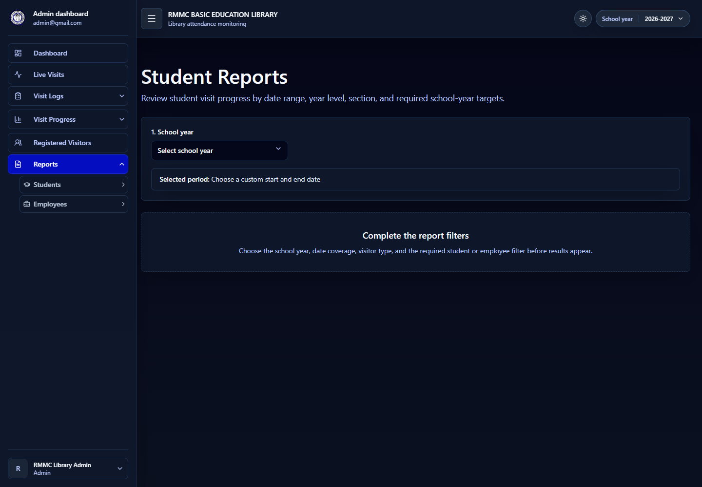

# RMMC Basic Education Library Attendance Monitoring System

A web-based library attendance monitoring system for RMMC Basic Education. The application records student and employee library visits through RFID scanning and gives library staff a practical admin workspace for daily monitoring, roster management, visit progress tracking, and report preparation.

The system is built around a simple operational goal: make every library visit easy to record, easy to review, and useful for attendance-based library decisions.

## Snapshots

### Public RFID Scanner

### Admin Dashboard

### Live Visit Monitor

### Registered Visitors

### Reports

## Purpose

This project helps library staff monitor how students and employees use the library during an active school year. Visitors can be recorded through RFID cards, school IDs, or supported lookup entries, while administrators can review visits, track required attendance progress, and prepare reports for school records.

Although the core system is attendance monitoring, it also supports day-to-day library operations through useful staff tools: live visit visibility, searchable logs, registered visitor maintenance, import previews, school-year setup, scan rules, and export-ready reports.

## Core Workflows

- Record library visits through an RFID-focused public scanner.
- Search and record visitors manually when RFID input is not available.
- Monitor live student and employee visits from the admin workspace.
- Manage registered student and employee profiles.
- Import visitor rosters with preview and validation steps.
- Configure school years, sections, departments, and required visit targets.
- Review visit logs by date range, year level, section, and department.
- Track required visit progress for students and employees.
- Generate reports for attendance review and official documentation.

## Librarian View

From a librarian's perspective, the application is meant to answer practical daily questions:

- Who visited the library today?
- Which students or employees are using the library often?
- Which groups have low library attendance?
- Are required visit targets being met?
- Which records need follow-up because of missing RFID or incomplete details?
- What report can be prepared for a selected school year or date range?

The interface prioritizes fast scanning, clear feedback, searchable records, and grouped summaries that help staff act on attendance data instead of only storing it.

## Current Progress

The project is already beyond a prototype. The main public scanner, admin dashboard, live visit monitoring, registered visitor management, import workflow, visit logs, visit progress, report generation, export services, school-year controls, and settings areas are implemented.

Recent focus areas include improving report comparison views, unifying table row sizing, strengthening dark-mode color consistency, adding clearer student/employee visit-log differentiation, and making registered visitor distribution easier to inspect by year level, section, and department.

## Export Direction

Reports should be the main source for official exports because they already combine date ranges, school-year context, visitor filters, required visit progress, and printable formats. Visit Logs and Visit Progress can still provide quick page exports when staff need the exact current table, but official school documentation is better handled from Reports to avoid duplicate export files with nearly identical data.

## Tech Stack

- Laravel
- Inertia.js
- React
- TypeScript
- Tailwind CSS
- Vite
- MySQL
- Laravel Echo / Reverb
- PHPUnit

## Main Areas

- Public scanner
- Admin dashboard
- Live visits
- Visit logs
- Visit progress
- Registered visitors
- Reports
- Settings

## Repository Note

The `.github` directory is useful when the repository needs GitHub Actions, issue templates, pull request templates, or other GitHub-specific automation. It is not required just to commit the application code, but it should be kept in the repository if the project uses the existing workflow files for linting, tests, or continuous integration.
